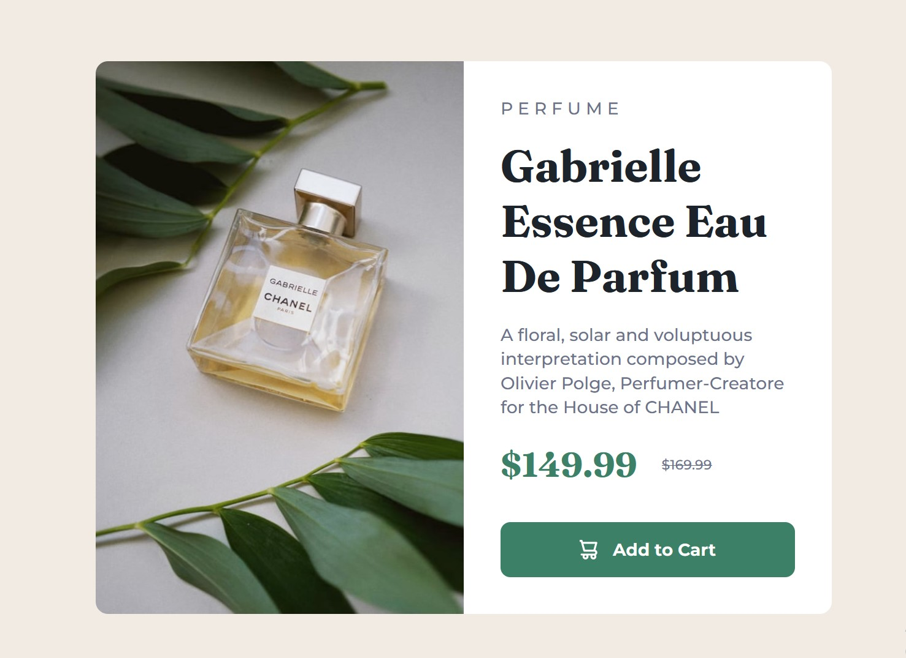

# Frontend Mentor - Product preview card component

## Table of contents

- [Overview](#overview)
  - [Screenshot](#screenshot)
  - [Links](#links)
- [My process](#my-process)
  - [Built with](#built-with)
  - [What I learned](#what-i-learned)
  - [Continued development](#continued-development)
- [Author](#author)
- [Acknowledgments](#acknowledgments)

## Overview

### Screenshot

### Links

- Solution URL: [Github repo to the code for the challenge](https://github.com/AllisonFavour/fm-challenge4)
- Live Site URL: [Vercel link to view the challenge](https://fm-challenge4.vercel.app)

## My process

Started by using HTML to give the structure of the layout and having the CSS styling in mind.

### Built with

- Semantic HTML5 markup
- CSS custom properties and Flexbox

### What I learned

I learnt to visualize my solutions first before coding it out. After taking my time to analyse the design image preview of the expected solution, since the Figma file wasnt available to free accounts and then i dived first with building the structure of the layout with HTML.

I learnt it is very important to visualize the HTML structure closely that will also enable our styling process. At first the design image preview looked simple until i started to code it out and i realized it was a bit complex so i had to rewrite my HTML structure having a solid CSS styling process in mind.

### Continued development

Hopefully, as time goes on i will get to learn about more on accessibility, because while thinking about it, i realized how essential it is to follow a top accessibility and HTML semantic approach to help with all kinds of users trying to access our websites and web apps.

## Author

- Website - [Allison Favour](https://allison-favour-portfolio-darkmode.vercel.app/)
- Frontend Mentor - [@AllisonFavour](https://www.frontendmentor.io/profile/AllisonFavour)
- Twitter - [@TrillestOjay](https://x.com/TrillestOjay)

## Acknowledgments

Thanks to myself for starting and finishing this particular project, also thanks to chatgpt and claude ai for the quick reminder and providing code suggestions.